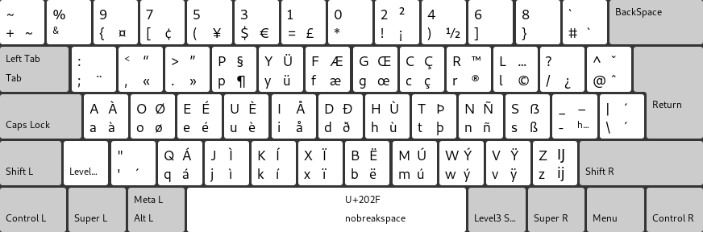
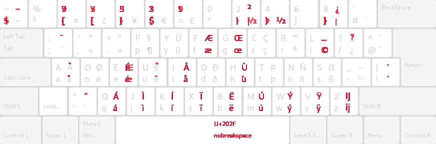
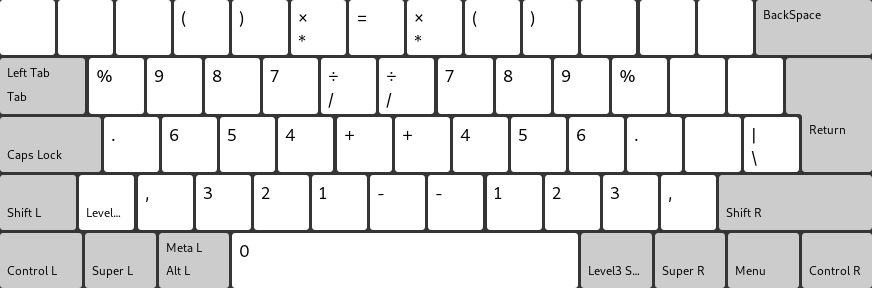

# Developer Dvorak Keyboard Layout

A derivative of the "[Programmer Dvorak Keyboard Layout](https://www.kaufmann.no/roland/dvorak/)" by Roland Kaufmann.

## Overview

### Layout




### Key features and differences

It retains most of the origin Programmer Dvorak layout and mostly only modify the top symbols/numbers row.

- Moves the dollar sign to a "strong" finger. This is because it is a prominent characters in PHP and other languages, so having it on the pinky finger is not comfortable.
- Make brackets/parenthesis open and close symetrically on the same fingers. I do appreciate the rationale from https://www.kaufmann.no/roland/dvorak/#brackets, but the intuitiveness of having them on the same fingers outweights this IMO. Also, most IDEs would help closing "empty" brackets anyway.
- Re-order odd numbers. Because, frankly? 7 5 3 1 9 0 2 4 6 8? Who can stand that? :D Kidding apart, it makes the 1/9 position easier to muscle-memorize.
- Add most frequently used west-european characters in the "blank" spots.
- Add a "NumPad"-like feature on Level 5 (see below), for laptops and condensed keyboards that don't have a keypad.

While those are really tiny changes, it aims to make the top row keys more intuitive and comfortable. Obviously, this is subjective.

Below's a diff with the original Programmer Dvorak layout.



### Numpad mode

The layout comes with a "numeric" mode, to emulate a keypad on laptops. It is a symetric layout, based on the idea you would hold the trigger key from the left hand and use it from the right hand, or vice-versa, based on your keyboard type and/or wether you're right-handed or left-handed.



It is available in two fashions:
- as the Level_5 mode within the Developer Dvorak layout. This let you assign whatever key you wish to trigger that level (usually the bottom left "greater than" key on a euro keyboard).
- as a separate layout (Developer Dvorak - NUM only). This is useful if you don't have a key you can dedicate to trigger the 5th level. You can instead activate both layouts and use your standard keyboard shortcut to switch from one to the other.

## Installation

*There is currently only a Linux version, other platform will follow if there is enough interest.*

Note: due to the way XKB works, there is no sane way to install a layout permanently without altering some system files. The install script below has only been tested on Debian, but should work for other platforms too.

### Trial

Because the install script has not been extensively tested, it defaults to a "trial" mode: instead of making the changes permanent, it will revert the changes it made on exit.

In a terminal:
- clone this repository: `git clone git@github.com:pm98zz-c/dvorak-dev.git`
- make the install script executable: `chmod +x install.sh`
- execute it: `sudo ./install.sh`

The script will wait for input, and pressing "Enter" will just undo the changes it made. Let it run while you use the new layout.
To actually use the layout, you can either:
- select "English > Developer Dvorak" from your GUI language settings (Gnome/KDE)
- or, from another terminal window/tab: `setxkbmap us -variant dvorak-dev`

None of those changes should be permanent, so if anything goes sour, just end your session.

### Permanent

Once you've performed the steps above and you're confident nothing is utterly broken, you can apply the changes permanently.
For that, just re-run the install script, passing it a --keep flag.

```
sudo ./install.sh --keep
```
